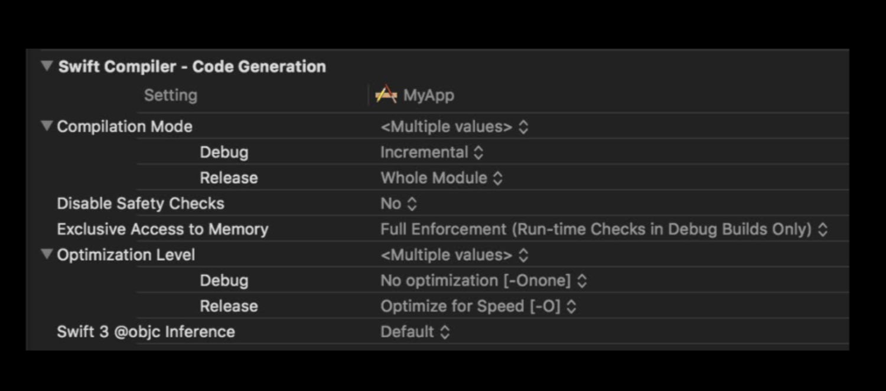

# What's New in WWDC2018

## Swift4.2

- CaseIterable Protocol
	- enum 에서 해당 프로토콜을 따르면 .allCases 속성이 자동으로 생성됩니다.
- Array, Dictionary, Optional (Set 제외)에 저장된 요소가 Equatable, Hashable, Encodable, Decodable인 경우 위 wrapper에도 해당 구현이 추가됩니다.

- 모든 저장속성이 Equatable인 경우 컴파일러가 자동으로 Equatable 구현을 해준다.

- Hashable 프로토콜에 대해 새로운 hash(into:) 가 추가되어 hash 계산을 해준다.

- Random 함수생김 > Int.random(in: 0..<10)
- shuffled()
- randomElement()

```swift
#if canImport(UIKit)
import UIKit
#else 
import AppKit
#endif

#if hasTargetEnvironment(simulator)
// Simulator
#else
// Actual Device
#endif
```

- swift debug build




## Cocoa Touch

###Notification
- Custom Notification에서 터치 이벤트를 처리할 수 있게 되었습니다.
- Notification Center 표시되는 노티피케이션이 앱을 기준으로 그룹핑 됩니다.
- Thread Identifier를  활용해서 원하는 항목을 따로 그룹핑 할 수 있습니다.


###Password AutoFill

- 비밀번호 자동 생성 기능이 추가되었습니다.
- 비밀번호 생성 조건을 지정할 수 있고, 계정 생성 화면에 통합할 수 있습니다.
- Two-factor Authentication을 사용하는 경우 디바이스에 전달된 인증 코드를 자동으로 인식하고 Quick Type 목록에 표시합니다. 그래서 한 번의 탭으로 쉽게 입력할 수 있습니다.

###Siri Shortcuts

- iOS 12부터 앱이 제공하는 기능을 Siri를 통해 실행할 수 있습니다. 그리고 Coversheet와 Siri Watch Face를 통해서 사용자에게 특정 기능을 제안할 수 있습니다. 사용자가 직접 음성을 등록하고 기능을 실행하는 것도 가능합니다.

- NSUserActivity를 활용해서 Handoff나 Spotlight 기능을 이미 구현해 두었다면 eligibleForPrediction 속성을 true로 설정하는 것만으로 Siri Shortcuts을 적용할 수 있습니다.

- Siri Kit Intents API를 활용하면 조금 더 복잡한 Siri Shortcuts을 구현할 수 있습니다. 여기에는 다양한 기본 Intent가 정의되어 있습니다.

- Car Commands, Notes, Messaging, Lists, VoIP Calling, Photo Search, Car Play, Workouts, Payments, Visual Codes, Ride Booking, Restaurant Reservations

- iOS 12에서는 직접 Custom Intent를 추가할 수 있습니다. 사용자는 Custom Voice Shortcut을 생성하고 Intent와 연결할 수 있습니다. 그리고 생성된 Shortcut은 Shortcuts 앱을 통해서 관리할 수 있습니다. (Shortcuts 앱은 향후 AppStore를 통해 다운로드 할 수 있습니다.)

## Automatic Strong Passwords and Security Code AutoFill


###Automatic Strong Password

- iOS 12의 iCloud Password Keychain Manager는 로그인 뿐만 아니라 계정 생성 과정도 단축시켜 줍니다. 키체인에 저장되어 있는 정보를 토대로 사용자 이름을 자동으로 제안해 주고 비밀번호도 자동으로 생성해 줍니다.

- 이전과 마찬가지로 텍스트 필드의 Content Type을 지정하는 방법으로 쉽게 구현할 수 있습니다.

```swift
UITextContentType.newPassword
```

- 비밀번호는 20문자 길이로 생성되고 영대소문자, 숫자, 하이픈 문자로 구성됩니다. 대부분의 서비스와 호환되는 포멧으로 생성되며 71비트 이상의 앤트로피로 생성되기 때문에 높은 보안성을 제공합니다.

- 새로운 생성 규칙을 작성한 후 UITextInputPasswordRules 인스턴스를 생성하고 passwordRules 속성에 할당하는 방식으로 구현할 수 있습니다.

```swift
let rules = UITextInputPasswordRules(descriptor: "required: lower; required: upper; required: digit; required: [-]; minlength: 20;")
passwordField.passwordRules = rules
```

###Security Code AutoFill

- 입력 필드의 Content Type을 iOS 12에서 새롭게 도입된 oneTimeCode로 지정하면 메시지로 전달된 인증코드를 인식할 수 있습니다.

- 인식된 코드는 QuickType Bar에 자동으로 표시되고 한 번의 탭으로 쉽게 입력할 수 있습니다.

- iOS와 macOS가 지원하는 모든 언어를 인식할 수 있지만 메시지에 인증코드를 추론할 수 있는 단어가 포함되어 있어야 합니다. 인증 메시지는 자신에게 메시지를 보내는 방법으로 테스트 할 수 있습니다. 아래와 같이 코드 복사 메뉴가 표시된다면 Security Code AutoFill로 인식할 수 있습니다.

- macOS에서 Safari를 통해 인증 과정을 실행하고 있다면 아이폰으로 전달된 메시지가 macOS로 자동으로 전송되고 입력 필드 아래쪽에 코드를 입력할 수 있는 메뉴가 제공됩니다.


###AutoFill Credential Provider Extension

- AuthenticationServices 프레임워크가 제공하는 API를 활용해서 직접 Password Manager App을 구현하고 Password Auto Fill 기능과 통합할 수 있습니다.


## What’s New in User Notification

- iOS 12부터 모든 노티피케이션은 앱을 기준으로 그룹핑 됩니다.

- 앱으로 전달된 노티피케이션은 기본적으로 App Group에 추가되지만 Thread Identifier를 활용해서 커스텀 그룹을 생성할 수 있습니다. 노티피케이션을 사용자 별로 그룹핑하거나 특정 이벤트를 기준으로 그룹핑 할 수 있습니다. Thread Identifier를 지정해 두면 자동으로 새로운 그룹이 생성되고 동일한 Thread Identifier를 가진 노티피케이션은 App Group 대신 이 그룹으로 전달됩니다.

```swift
let content = UNMutableNotificationContent()
content.title = "New Photo"
content.body = "Jane Doe posted a new photo"
content.threadIdentifier = "thread-identifier"
```

```js
{  
   "aps":{  
      "alert":{  
         "title":"New Photo",
         "body":"Jane Doe posted a new photo",
         "thread-id":"thread-identifier"
      }
   }
}
```
